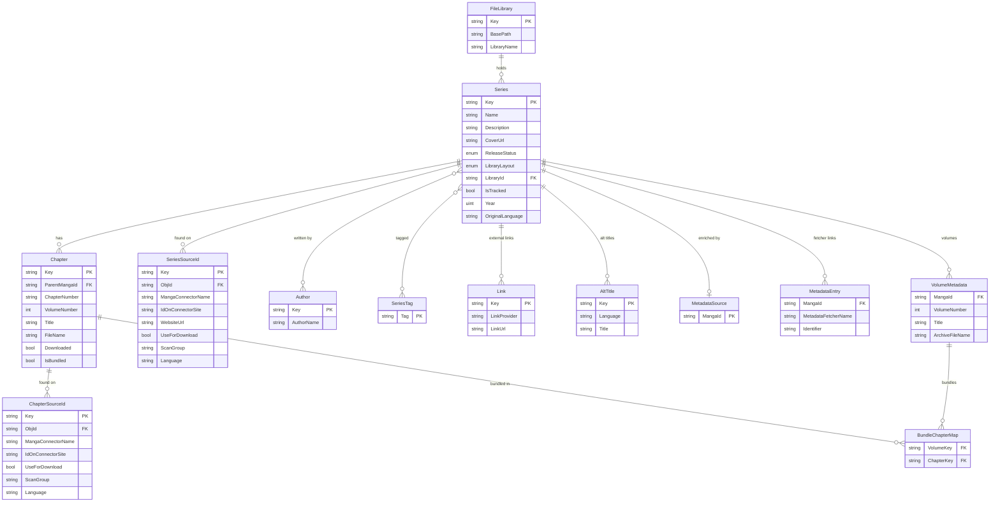

## Contributing

If you want to contribute, please feel free to fork and create a Pull-Request!

### General rules (Codestyle)

- Use explicit types for your variables. This improves readability.
    - **DO**
      ```csharp
      Series[] zyx = Object.GetAnotherThing(); //I can see that zyx is an Array, without digging through more code
      ```
    - **DO _NOT_**
      ```csharp
      var xyz = Object.GetSomething(); //What is xyz? An Array? A string? An object?
      ```

- Indent your `if` and `for` blocks
    - **DO**
      ```csharp
      if(true)
        return false;
      ```
    - **DO _NOT_**
      ```csharp
      if(true) return false;
      ```
      <details>
        <summary>Because try reading this</summary>

        ```csharp
        if (s.StartsWith("http://", StringComparison.OrdinalIgnoreCase) || s.StartsWith("https://", StringComparison.OrdinalIgnoreCase)) return s;
        ```

      </details>

- When using shorthand, _this_ improves readability for longer lines (at some point just use if-else...):
```csharp
bool retVal = xyz is true
    ? false
    : true;
```
```csharp
bool retVal = xyz?
    ?? abc?
    ?? true;
```

### If you want to add a new source connector:

1. Copy one of the existing connectors in `API/Connectors/`, or start from scratch and inherit from
   `API.Connectors.SeriesSource` (override `SearchManga`, `GetMangaFromUrl`, `GetMangaFromId`,
   `GetChapters`, and `GetChapterImageUrls` for page-reader sources).
2. Register it in `API/Extensions/ApplicationServiceCollectionExtensions.cs` as
   `services.AddSingleton<SeriesSource, YourConnector>();`. It is then picked up everywhere connectors
   are injected — search, discovery rails, and downloads. Connectors are DI services, not database
   entities, so no discriminator or migration is needed.

### Database and EF Core

Kenku is using a **code-first** EF-Core approach. If you modify the database(context) schema you need to create a migration.

###### Configuration Environment-Variables:

| variable          | default-value    |
|-------------------|------------------|
| POSTGRES_HOST     | `kenku-pg:5432` |
| POSTGRES_DB       | `postgres`       |
| POSTGRES_USER     | `postgres`       |
| POSTGRES_PASSWORD | `postgres`       |

#### Core schema (`SeriesContext`)

The series/chapter domain. Other contexts — jobs, actions/audit, notifications, libraries, and
discovery — live in their own databases and are omitted here.



> Some tables still carry pre-rename names: `Series` is table `Mangas`, and `SeriesSourceId` /
> `ChapterSourceId` are `MangaConnectorToManga` / `MangaConnectorToChapter`. Renaming them needs a
> hand-written migration — see [`TECHNICAL_DEBT.md`](TECHNICAL_DEBT.md).

### A broad overview of where is what:

- `Program.cs` Configuration for ASP.NET, Swagger (also in `NamedSwaggerGenOptions.cs`)
- `Kenku.cs` Worker-Logic
- `Connectors/**` Source connectors (page scrapers, direct-archive, and indexer-backed torrent sources)
- `Schema/**` Entity-Framework Schema Definitions
- `HttpRequesters/**` Networking-Clients for Scraping (HTTP/FlareSolverr/Chromium request strategies)
- `DownloadClients/**` Download-client integrations for release acquisition (qBittorrent)
- `Controllers/**` ASP.NET Controllers (Endpoints)

### How to test locally

In the Project root a `docker-compose.local.yaml` file will spin up a Postgres Database with the correct settings.
The [launchsettings.json](https://github.com/chutch3/kenku/blob/main/API/Properties/launchSettings.json) will take care of the ENV vars for the API.
