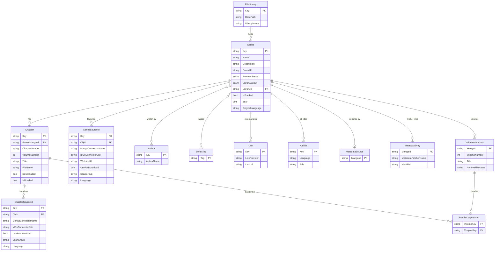

# Database schema

The core series/chapter domain (`SeriesContext`). Kenku splits persistence across several EF Core
contexts, each in its own database — jobs, actions/audit, notifications, libraries, and discovery
live in their own schemas and are omitted here.

> A few tables still carry pre-rename names: `SeriesSourceId` / `ChapterSourceId` are tables
> `MangaConnectorToManga` / `MangaConnectorToChapter`, and `Author`↔`Series` joins through `AuthorToManga`.
> (The main `Series` table was renamed from `Mangas`.) See [`TECHNICAL_DEBT.md`](../TECHNICAL_DEBT.md).
