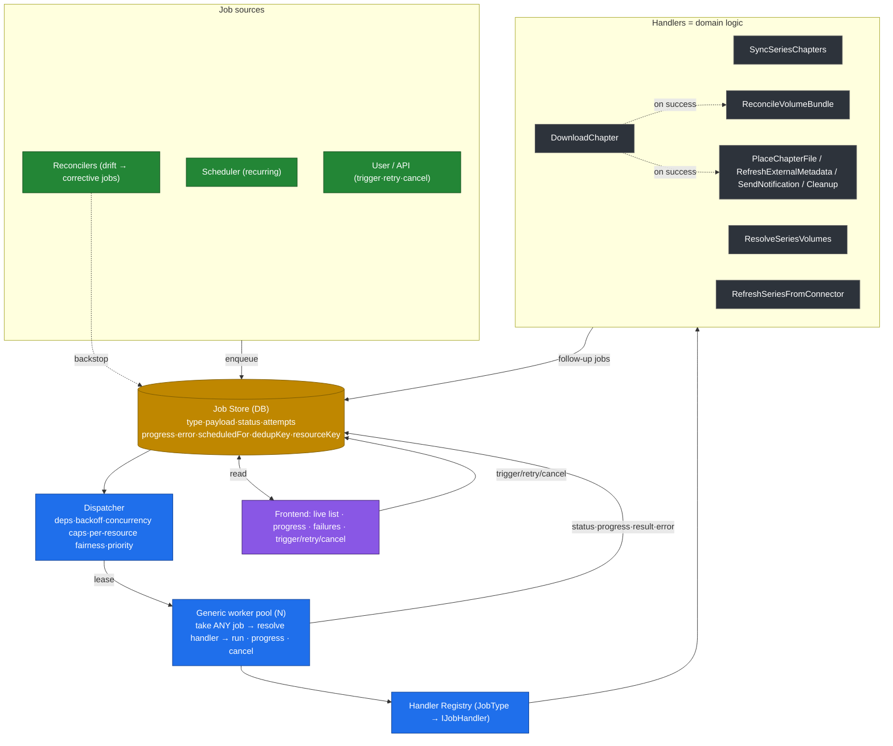
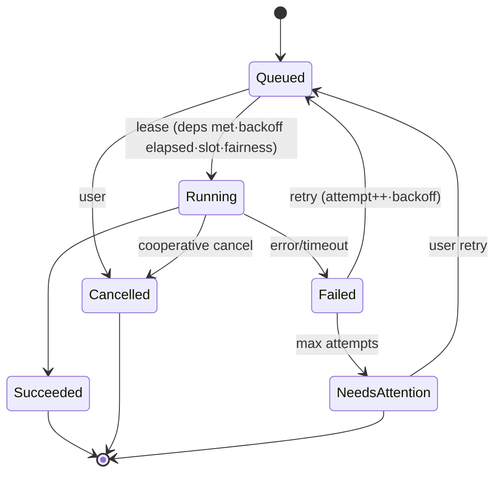
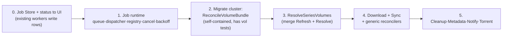

# Job runtime re-architecture (plan)

**Problem:** ~26 bespoke worker classes coordinate implicitly via DB state + periodic ticks. No persisted status, no failure tracking, blind retries on a shared budget. Bugs hide (e.g. a download loop ran ~9h silently) and pipelines are hard to integration-test.

**Goal — two things at once, deliberately:**
1. **Simplify** — collapse ~26 bespoke worker classes into ~8 handlers + one generic reconciler.
2. **Make the unit of work a first-class citizen** — one persisted job runtime + generic worker pool + handler registry, where every job has a *declared input, a recorded outcome, idempotency, and observability*, with status surfaced to the UI and user control (trigger/retry/cancel).

(1) shrinks the surface where P1 bugs hide; (2) kills P1 and makes P2 testable. Domain logic is preserved; only the lifecycle/scheduling unify.

> This doc is a handoff: another agent should be able to implement from it. Read **How we work** and **Getting started** before writing code.

## Root cause (verified)

Every recurring bug is one of two patterns. The common root: **"a unit of work" is not first-class** — no recorded outcome, no declared input scope, not idempotent.

- **P1 — outcome never recorded.** Work is level-triggered by re-querying mutable DB state; nothing records "did it succeed / how often has it failed." → silent, infinite, unobservable, starving.
- **P2 — wrong/partial data scope.** An operation loads an implicit slice of data and assumes it's the right one. → correctness bugs.

| Bug | P1 | P2 | also |
|---|---|---|---|
| Download loop (#31) | ✓✓ silent fail → infinite re-queue, no fairness | | rate-limit/timeout cancel + all-or-nothing write |
| Cover `NullRef` ×24 | ✓ failed silently, re-attempted | ✓ used un-loaded `mcId.Obj` | |
| Volume download-gating | | ✓ loaded only downloaded chapters | |
| UpsertManga link-drop | | ✓ merge path didn't carry links | |
| Id-match rollback | ✓ good result treated as failure | | |
| Re-fetch trigger gap | ✓ no explicit trigger, state-only | | |

**The framework kills P1 directly** (recorded outcome → bounded retry → `NeedsAttention` + per-resource fairness). **It only makes P2 _testable_** — each handler is an isolated unit with a declared input; P2 stays a logic bug caught by per-handler tests, not eliminated. So a real test harness is non-negotiable.

### Verified download chain (#31 — current 0.8.0 code, unchanged since 0.7.1)
1. `HttpRequester`: `new HttpClient(rateLimitHandler){ Timeout = 60s }` — the limiter sits **inside** the timed client.
2. `RateLimitHandler.SendAsync:52`: `await _limiter.AcquireAsync(req, …, ct)` with the HTTP-timeout-linked `ct` → the **queue wait is charged against the 60s timeout** (reproduced in a unit test; prod stack lands exactly here).
3. `ImageListAcquirer`: buffers **all** ~207 images, writes the `.cbz` only at the end, `catch → return null` → one cancel discards everything (empty `Ichi the Killer/` dir confirms).
4. `DownloadChapterFromSourceWorker`: `acquiredPath is null → return []` — never marks `Downloaded`; "Completed" only means the worker ran.
5. `StartNewChapterDownloadsWorker`: re-queries `!Downloaded` → re-spawns the same chapter → infinite.
6. `OrderBy(ChapterComparer).Take(MaxConcurrentDownloads)`, **no per-series cap** → one big series (Ichi, 10 volume-chapters) holds all slots and starves the rest.

## Target runtime



## Job lifecycle



## Handler set (units of work) + mapping

Reconcilers become **config** (`interval · predicate · jobType`), not classes. Units of work become the handlers below.

| Proposed handler | Replaces |
|---|---|
| **SyncSeriesChapters** | RetrieveChaptersFromSource (+ CheckForNewChapters scan) |
| **DownloadChapter** | DownloadChapterFromSource (+ StartNewChapterDownloads scan) |
| **RefreshSeriesFromConnector** | DownloadCoverFromSource + connector link/metadata capture (also = the missing "refresh from connector" trigger) |
| **ResolveSeriesVolumes** | ResolveMissingVolumesForManga + RefreshMetadataSource (same op) |
| **ReconcileVolumeBundle** | BundleVolume + UnbundleVolume + EnsureReadyVolumesBundled + EnsureBundledVolumesFresh |
| **PlaceChapterFile** | RenameChapterFile + MoveFileOrFolder + SyncChapterFileNames |
| **RefreshExternalMetadata** | UpdateMetadata |
| **SendNotification** | SendNotifications (DownloadChapter enqueues on success; NotifyOnNewDownloads polling observer deleted) |
| **Cleanup** (parameterized) | RemoveOldNotifications + CleanupOrphanedFiles + CleanupMangaCovers + CleanupSourceIdsWithoutSource |
| _kept separate_ | TorrentCompletion + UpdateChaptersDownloaded → a poll-then-finalize reconciler (external client) |

Net: ~26 classes → ~8 handlers + 1 generic reconciler (declarative list) + cleanup + torrent.

## Root-cause coverage (the class of bug we keep hitting)

Every recurring incident shares a shape: **a unit of work fails in a non-obvious way, and the system can't see it, doesn't bound it, retries it unsafely, and lets it starve everything else.** The download loop is canonical — a request's rate-limit queue-wait is charged against the 60s HTTP timeout (`RateLimitHandler.SendAsync`), the acquirer discards all ~200 images on that cancel, and it re-queues forever across all download slots.

The runtime **alone does not fix the failing handler** — it only makes failures visible, bounded, and fair. Fixing the *class* needs all three layers:

| Layer | Contract it must add | Incidents it fixes |
|---|---|---|
| **Runtime** | persisted status · attempt cap → `NeedsAttention` · per-resource fairness · cooperative cancel | silent loops · infinite retry · one series starving all (the #31 *symptoms*) |
| **Handler** | **idempotent + resumable** (write-temp→move, safe re-run, no all-or-nothing) | partial-write loss · unsafe retry (the #31 *amplifier*, cover NullRef on stale entity) |
| **Infra** | rate-limit wait must **not** count against the request timeout; dispatcher honors the downstream throttle (don't lease 6 jobs the host bucket can't feed) | the actual #31 cancel + pileup |

Runtime is **necessary but not sufficient.** Idempotency and the rate-limit/timeout fix are *requirements*, not afterthoughts. Logic bugs (volume gating, link-drop on merge) are out of scope for any of this — they're caught by **per-handler tests**, so the plan must ship a real test harness (sync "run one job", in-memory store, fake clock), not just claim testability.

> Config lesson from this incident: the 60s→600s mitigation lived only as a `service update` env, so a redeploy reverted it. Operational knobs belong in code/compose (or better, fixed in code), not ad-hoc service edits.

## Migration (strangler — no big-bang)



Step 0 ships value alone (would have caught the #31 loop) and is independent of the rest.

## How we work (dev context — follow this)

**Repo:** .NET 10 API in `api/` (`api/API` app, `api/Tests` tests), Nuxt frontend in `web/website`, EF Core + Postgres (prod) / EF InMemory (tests). Workers live in `api/API/Workers`.

**TDD (required): red → green → refactor.**
- Write the failing test first; implement minimally; refactor on green.
- **Mutation-verify every behavioral change:** after green, revert the production change and confirm the test goes red. No hollow tests — a test that can't fail proves nothing. (We caught several this way.)

**Tests — layering:**
- **Unit:** one handler/unit in isolation. Backend: `dotnet test api/Tests/Tests.csproj --filter "FullyQualifiedName~Name"`. Frontend components: `cd web/website && npm run test:component` (+ `npm run typecheck`).
- **Integration = outside-in.** Boot the real app via `WebApplicationFactory<Program>` (`KenkuApplicationFactory`); the **DI container builds everything** (controllers, handlers, services). Swap only the **edges**: in-memory EF, WireMock for resolver HTTP, a stub `IHttpRequester` for connector HTTP. Drive behavior through real HTTP endpoints; assert via `WithSeriesContext` or the shared `WaitUntil`. Reuse the base `OutboundHttpIntegrationTest` + `IntegrationFixtures` — don't re-copy `WaitUntil`/fixtures.
- **DI is the rule:** never hand-construct what the container should build. Connectors were refactored to *inject* `IHttpRequester` precisely so the edge is swappable — keep that discipline for every job handler (inject deps; the test swaps only the edge).
- **Job-runtime test harness (build in migration step 1):** a synchronous "run one job" entry + in-memory job store + fake clock (for backoff/intervals), so a handler and the follow-up jobs it enqueues are asserted **without booting the app**. This is the payoff that makes P2 bugs catchable; it is non-negotiable.

**Commits & releases:**
- **Single-line Conventional Commits** — `type: short description`. **No scope** (`(parens)`), **no body**, **no self-promotion** (no `Co-Authored-By`, no "Generated with Claude Code"). Same rule for PR descriptions.
- Only amend **local/unpushed** commits to fix format; never rewrite pushed/released history.
- Branch off `main` for a PR; prefer `gh pr merge --rebase` so clean commits land on `main`.
- Release = the **Release** GitHub workflow (`workflow_dispatch`) → semantic-release → version tag + `ghcr.io/chutch3/kenku:<version>` image (`feat:`→minor, `fix:`→patch). `:latest` builds on push to `main`.

**Build/ops gotchas:**
- Run backend tests via the **Tests** project; building `api/API/API.csproj` directly triggers OpenAPI generation that writes to a system path (fails in restricted sandboxes).
- Prod is Docker Swarm service `downloads_kenku`; image pinned in the **homelab** repo (`stacks/apps/downloads/docker-compose.yml`). Operational knobs (`HTTP_REQUEST_TIMEOUT`, `REQUESTS_PER_MINUTE`) are read from env at startup — set them in compose, **not** ad-hoc `service update` (those revert on redeploy).

**Ship a change — release + deploy runbook.** End-to-end once a PR is green on `main`:
1. **Merge** (clean history, no merge bubble): `gh pr merge <n> --rebase --delete-branch`, then `git checkout main && git pull --ff-only`.
2. **Release** — dispatch the manual workflow; semantic-release derives the version from commit types (`feat:`→minor, `fix:`→patch) and builds + pushes the image:
   ```bash
   gh workflow run Release --ref main          # workflow_dispatch
   rid=$(gh run list --workflow=Release --limit 1 --json databaseId --jq '.[0].databaseId')
   gh run watch "$rid" --exit-status
   gh release view --json tagName --jq .tagName            # -> vX.Y.Z
   ```
   Produces tag `vX.Y.Z` + `ghcr.io/chutch3/kenku:X.Y.Z` (no `v`). Sanity check: `docker manifest inspect ghcr.io/chutch3/kenku:X.Y.Z`.
3. **Redeploy** — in the **homelab** repo, bump the pin in `stacks/apps/downloads/docker-compose.yml` (`image: ghcr.io/chutch3/kenku:X.Y.Z`), then from the homelab repo root:
   ```bash
   task ansible:deploy:service -- -e "stack_name=downloads"
   ```
   This runs `ansible/playbooks/deploy/stack.yml` against the `homelab-swarm` Docker context, updating the `downloads_kenku` stack (the playbook resolves `stack_name` → `stacks/apps/downloads/docker-compose.yml`). Verify the rollout: `docker service ps downloads_kenku` — new task `Running`, previous `Shutdown`.
- The compose-pin bump is a **separate commit in the homelab repo**; the Release workflow does **not** touch homelab. Conventional-commit rule applies there too (e.g. `chore: bump kenku to X.Y.Z`).

## Getting started (first concrete steps)
1. `git fetch && git checkout main` — sync to current (prod is **0.8.0**; engine code unchanged since 0.7.1).
2. Ground yourself: read `api/API/Workers/{BaseWorker,PoolWorker,WorkerQueue}.cs` + the worker dirs; the current worker map is in the repo's earlier diagram / this doc's mapping table.
3. **Ship the two sibling fixes first** (smallest real wins; they ARE the live incident, TDD + mutation):
   - `RateLimitHandler`: acquire the rate token **outside** the request-timeout window (or run the wait under the worker token, timeout only the network send). A reproduction test already exists in `api/Tests/HttpRequesters/RateLimitHandlerTests.cs` (uncommitted) — flip it to assert the *fixed* behavior.
   - `ImageListAcquirer`: write incrementally / temp-then-move so a late cancel doesn't discard the whole chapter.
4. Then follow the **Migration** order: step 0 (job store + status to UI) → step 1 (runtime + the test harness above) → bundling cluster → resolve → download/sync → cleanup/metadata/notify/torrent.
- Tracking: issues **#31** (download loop) and **#29** (retry-throttling) are both subsumed by this plan.

## Surfaced concerns from 0.8.0 use (fold into this work)

Two product pain points surfaced while using the 0.8.0 UI. Both intersect this re-arch; capture them now so the runtime + handler work accounts for them instead of cementing the current shape.

### A. Activity should become the job-runtime view (this plan already enables it)

Today **Activity** (`web/website/app/pages/actions.vue` → `POST /v2/Actions/Filter`, `ActionRecord` rows) is a backward-looking audit log: *what happened*, with no live state and no control. The job runtime's **Job Store + status-to-UI** (migration Step 0) is exactly what makes Activity genuinely useful — `Queued · Running · Failed · NeedsAttention` with progress and **retry/cancel** (the `FE` node in the target-runtime diagram).

- **Decision needed:** does the new live "Jobs" surface *replace* the Activity audit log, *merge* with it (jobs + the actions they produce in one timeline), or sit beside it? **Recommendation:** one **Activity** surface, two lenses — **Live** (Job Store) and **History** (ActionRecords) — sharing the per-series/per-chapter + date filters `actions.vue` already has.
- Implication: **Step 0 should ship the UI, not just the table.** It's the highest-visibility early win and would have made the #31 loop obvious.

### B. Metadata is fragmented — three write paths, two+ UIs, no precedence (open design question)

A series' metadata is written by **three independent paths with no declared precedence**, surfaced through **two separate "link" UIs plus a Settings toggle** — which is why it feels "all over the place." Mapping is from a code-read pass (**verify** — see Assumptions):

| Path (→ handler) | Writes | Cardinality | UI surface |
|---|---|---|---|
| **Download connector** (→ `RefreshSeriesFromConnector`) | Name, Description, CoverUrl, Authors, AltTitles, Links | 1 per source id | none (implicit on add/refresh) |
| **MetadataSource** (→ `ResolveSeriesVolumes`) | chapter `VolumeNumber` + `MetadataConfidence` **only** | **1:1** (`Connector·MangaDex·AniList·Manual`) | "Metadata source" card (`MetadataSourceLink.vue`) |
| **MetadataFetcher** (→ `RefreshExternalMetadata`) | Name, Description, CoverUrl, Authors, AltTitles | **N** (MyAnimeList, Metron) | "Metadata" table (`SeriesMetadataFetcherTable.vue`) + Metron in Settings |

The genuine confusion is **not** that volume-resolution and enrichment are separate concerns (they are). It's that:

1. **Name/Description/Cover have three writers and no precedence rule.** The connector sets them on add; a MetadataFetcher later overwrites them; nothing declares who wins or how fields merge. This is the **P2 shape** (an op writes an implicit slice) — so it belongs in the same test harness, and `MetadataConfidence` (the per-chapter precedence floor for volumes) is the precedent to copy for *fields*.
2. **Two link UIs look identical** ("search a provider → link") but do different things, and **AniList/MyAnimeList appear in both** the MetadataSource matcher and the enrichment fetchers.
3. **Metron is a MetadataFetcher but lives in Settings**, so it appears in two places.

**Open question for the implementing agent (decide before/with the metadata handlers):** keep the three handlers, but introduce **one metadata-resolution policy** — declared per-field precedence + provenance (who set Name/Cover/…), mirroring the `MetadataConfidence` floor — and **one UI surface** that shows "where each field comes from," instead of three link flows? That's a domain-model decision with real logic → cover it in the P2 handler tests.

- **Cheap near-term UI fix (no backend, can ship now):** relabel to make the distinction obvious — e.g. **"Volume mapping (MangaDex)"** vs **"Series details (MyAnimeList / Metron)"** — and surface Metron in one place. This does not require the rearch.

## Assumptions (verify before relying on)
- **Diagnosis (P1/P2):** the root is observability + implicit coordination (P1) and wrong-scope logic (P2), not raw class count. The framework kills P1 and makes P2 testable — it does **not** auto-fix P2 logic.
- **Persistence:** Job rows live in the existing EF/Postgres DB (new context/table) — *assumed, not yet designed.*
- **Reconcilers are declarative** (`interval · predicate · jobType`); a few (e.g. bundle freshness via `VolumeBundlePolicy`) will need custom code.
- **`DownloadChapter` absorbs torrent via `IChapterAcquirer`** — *unverified*; torrent's poll-then-finalize may stay a distinct flow (kept separate to be safe).
- **`RefreshSeriesFromConnector`** assumes cover + links + title come from one connector page (true for WeebCentral; *verify per connector*).
- **Cancellation is cooperative** — handlers must honor the token; most current workers don't yet.
- **`MaxConcurrentDownloads` is a setting** (settings.json), not env; dispatcher fairness must account for it *and* the downstream per-host rate limit, or the #31 pileup recurs.
- **UI is poll-based** (no realtime/websocket infra assumed).
- **`ResolveMissingVolumesForManga` ≡ `RefreshMetadataSource`** — verified via their summaries.
- **Handoff state:** this doc + the `RateLimitHandlerTests.cs` reproduction test are **uncommitted** as of writing; no effort/time estimates given (sequencing only).
- **Metadata write-path table (Surfaced concerns §B):** assembled from a code-read pass, **not hand-verified**. Confirm exactly which path writes which `Series` field (esp. who owns `CoverUrl` vs `Authors`), and that `MetadataSource` is volume-only while `MetadataFetcher` is enrichment-only, before designing any precedence policy. Key files: `Controllers/MetadataSourceController.cs`, `Controllers/MetadataFetcherController.cs`, `Schema/SeriesContext/MetadataSource.cs`, `Schema/SeriesContext/MetadataFetchers/{MetadataFetcher,MyAnimeList,Metron}.cs`.
- **Metadata providers:** `MetadataSource.SourceType` is assumed `Connector·MangaDex·AniList·Manual`, and `MetadataFetcher` impls are MyAnimeList + Metron only — verify there are no others and that AniList is **matcher-only** (no standalone AniList fetcher).
- **Activity merge (Surfaced concerns §A):** the "one surface, Live + History lenses" shape is a **recommendation**, not a constraint — confirm with product before building. Assumes the Job Store and `ActionRecord` log stay distinct stores (jobs ≠ actions).
