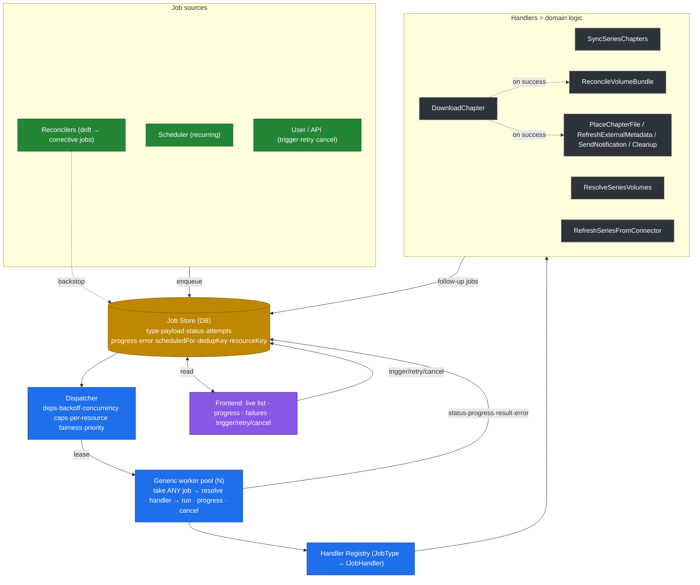
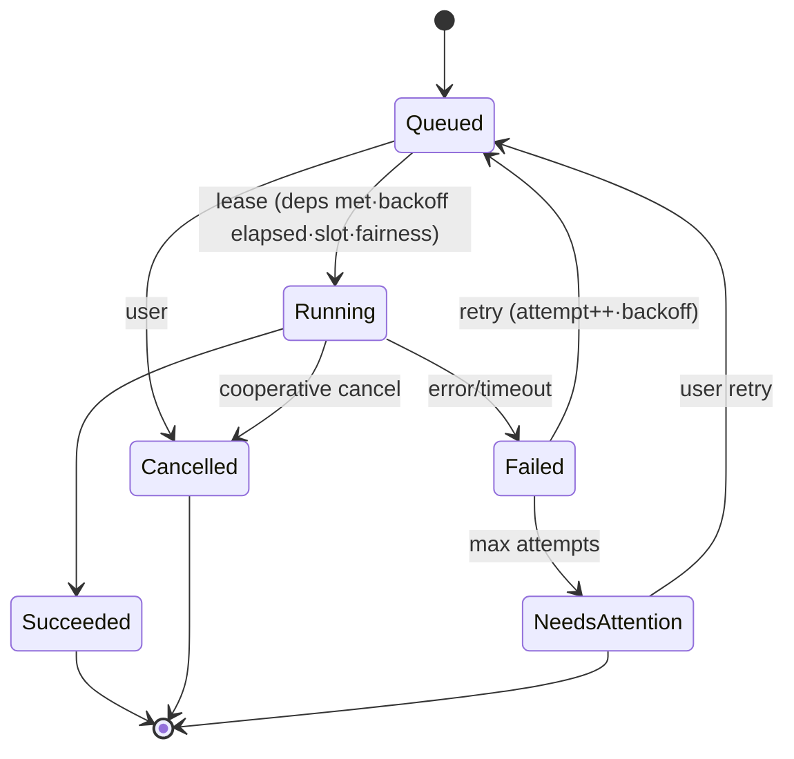
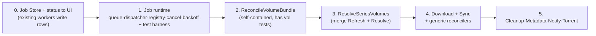

# Job runtime re-architecture — implementation plan

> **Handoff doc.** Read §1–§2 for context and §7 for the working rules, then start at §6. Implement strangler-style: **one verified slice at a time** (§5).

**Contents:** [1 Problem & goal](#1-problem--goal) · [2 Root cause](#2-root-cause-and-what-fixes-it) · [3 Target design](#3-target-design) · [4 Acceptance criteria](#4-acceptance-criteria-the-safety-net) · [5 Migration](#5-migration-strangler--one-slice-at-a-time) · [6 Getting started](#6-getting-started) · [7 How we work](#7-how-we-work) · [8 Assumptions](#8-assumptions--open-questions)

---

## 1. Problem & goal

**Problem:** ~26 bespoke worker classes coordinate implicitly via DB state + periodic ticks. No persisted status, no failure tracking, blind retries on a shared budget → bugs hide (a download loop ran ~9h silently) and pipelines are hard to integration-test.

**Goal — two things at once, deliberately:**
1. **Simplify** — ~26 worker classes → ~8 handlers + one generic reconciler.
2. **Make the unit of work first-class** — one persisted job runtime + generic worker pool + handler registry; every job has a *declared input, recorded outcome, idempotency, observability*; status + control (trigger/retry/cancel) surfaced to the UI.

(1) shrinks where P1 bugs hide; (2) kills P1 and makes P2 testable. Domain logic is preserved; only lifecycle/scheduling unify.

---

## 2. Root cause (and what fixes it)

Common root: **a "unit of work" is not first-class** — no recorded outcome, no declared input scope, not idempotent. Two patterns; every recurring bug is one or both:
- **P1 — outcome never recorded.** Work is level-triggered by re-querying mutable DB state; nothing records "did it succeed / how often has it failed." → silent, infinite, unobservable, starving.
- **P2 — wrong/partial data scope.** An operation loads an implicit slice of data and assumes it's the right one. → correctness bugs.

| Bug | P1 | P2 | also |
|---|---|---|---|
| Download loop (#31) | ✓✓ silent fail → infinite re-queue, no fairness | | rate-limit/timeout cancel + all-or-nothing write |
| Cover `NullRef` ×24 | ✓ failed silently, re-attempted | ✓ used un-loaded `mcId.Obj` | |
| Volume download-gating | | ✓ loaded only downloaded chapters | |
| UpsertManga link-drop | | ✓ merge path didn't carry links | |
| Id-match rollback | ✓ good result treated as failure | | |
| Re-fetch trigger gap | ✓ no explicit trigger, state-only | | |

**What fixes the class — three layers (runtime alone is necessary but not sufficient):**

| Layer | Contract it must add | Fixes |
|---|---|---|
| **Runtime** | persisted status · attempt cap → `NeedsAttention` · per-resource fairness · cooperative cancel | P1: silent loops, infinite retry, starvation |
| **Handler** | **idempotent + resumable** (write-temp→move, safe re-run, no all-or-nothing) | partial-write loss, unsafe retry |
| **Infra** | rate-limit wait must **not** count against the request timeout; dispatcher honors the downstream throttle | the actual #31 cancel + pileup |

P1 dies with the runtime. **P2 stays a logic bug** — caught by per-handler tests, not eliminated — so the test harness (§7) is non-negotiable.

### Verified download chain (#31 — current 0.8.0 code, unchanged since 0.7.1)
1. `HttpRequester`: `new HttpClient(rateLimitHandler){ Timeout = 60s }` — the limiter sits **inside** the timed client.
2. `RateLimitHandler.SendAsync:52`: `await _limiter.AcquireAsync(req, …, ct)` with the HTTP-timeout-linked `ct` → the **queue wait is charged against the 60s timeout** (reproduced in a unit test; prod stack lands exactly here).
3. `ImageListAcquirer`: buffers **all** ~207 images, writes the `.cbz` only at the end, `catch → return null` → one cancel discards everything (empty `Ichi the Killer/` dir confirms).
4. `DownloadChapterFromSourceWorker`: `acquiredPath is null → return []` — never marks `Downloaded`; "Completed" only means the worker ran.
5. `StartNewChapterDownloadsWorker`: re-queries `!Downloaded` → re-spawns the same chapter → infinite.
6. `OrderBy(ChapterComparer).Take(MaxConcurrentDownloads)`, **no per-series cap** → one big series (Ichi, 10 volume-chapters) holds all slots and starves the rest.

---

## 3. Target design

```mermaid
flowchart TB
    classDef store fill:#bf8700,color:#fff,stroke:#7a5901;
    classDef runtime fill:#1f6feb,color:#fff,stroke:#0b3d91;
    classDef handler fill:#2d333b,color:#fff,stroke:#666;
    classDef ui fill:#8957e5,color:#fff,stroke:#3d1d6e;
    classDef src fill:#238636,color:#fff,stroke:#114b1a;

    subgraph SRC["Job sources"]
      direction LR
      SCHED["Scheduler (recurring)"]:::src
      RECON["Reconcilers (drift &rarr; corrective jobs)"]:::src
      USERT["User / API (trigger·retry·cancel)"]:::src
    end

    STORE[("Job Store (DB)<br/>type·payload·status·attempts<br/>progress·error·scheduledFor·dedupKey·resourceKey")]:::store
    DISP["Dispatcher<br/>deps·backoff·concurrency caps·per-resource fairness·priority"]:::runtime
    POOL["Generic worker pool (N)<br/>take ANY job &rarr; resolve handler &rarr; run · progress · cancel"]:::runtime
    REG["Handler Registry (JobType &rarr; IJobHandler)"]:::runtime

    subgraph HAND["Handlers = domain logic"]
      direction LR
      H1["SyncSeriesChapters"]:::handler
      H2["DownloadChapter"]:::handler
      H3["ReconcileVolumeBundle"]:::handler
      H4["ResolveSeriesVolumes"]:::handler
      H5["RefreshSeriesFromConnector"]:::handler
      H6["PlaceChapterFile / RefreshExternalMetadata / SendNotification / Cleanup"]:::handler
    end

    FE["Frontend: live list · progress · failures · trigger/retry/cancel"]:::ui

    SRC -->|enqueue| STORE
    STORE --> DISP -->|lease| POOL --> REG --> HAND
    POOL -->|status·progress·result·error| STORE
    HAND -->|follow-up jobs| STORE
    STORE <-->|read| FE
    FE -->|trigger/retry/cancel| STORE
    RECON -. backstop .-> STORE
    H2 -. "on success" .-> H3
    H2 -. "on success" .-> H6
```

```mermaid
stateDiagram-v2
    [*] --> Queued
    Queued --> Running: lease (deps met·backoff elapsed·slot·fairness)
    Running --> Succeeded
    Running --> Failed: error/timeout
    Failed --> Queued: retry (attempt++·backoff)
    Failed --> NeedsAttention: max attempts
    Queued --> Cancelled: user
    Running --> Cancelled: cooperative cancel
    NeedsAttention --> Queued: user retry
    Succeeded --> [*]
    Cancelled --> [*]
    NeedsAttention --> [*]
```

**Handlers (units of work) — ~26 classes → ~8.** Reconcilers become **config** (`interval · predicate · jobType`), not classes.

| Proposed handler | Replaces |
|---|---|
| **SyncSeriesChapters** | RetrieveChaptersFromSource (+ CheckForNewChapters scan) |
| **DownloadChapter** | DownloadChapterFromSource (+ StartNewChapterDownloads scan) |
| **RefreshSeriesFromConnector** | DownloadCoverFromSource + connector link/metadata capture (also = the missing "refresh from connector" trigger) |
| **ResolveSeriesVolumes** | ResolveMissingVolumesForManga + RefreshMetadataSource (same op) |
| **ReconcileVolumeBundle** | BundleVolume + UnbundleVolume + EnsureReadyVolumesBundled + EnsureBundledVolumesFresh |
| **PlaceChapterFile** | RenameChapterFile + MoveFileOrFolder + SyncChapterFileNames |
| **RefreshExternalMetadata** | UpdateMetadata |
| **SendNotification** | SendNotifications (DownloadChapter enqueues on success; NotifyOnNewDownloads polling observer deleted) |
| **Cleanup** (parameterized) | RemoveOldNotifications + CleanupOrphanedFiles + CleanupMangaCovers + CleanupSourceIdsWithoutSource |
| _kept separate_ | TorrentCompletion + UpdateChaptersDownloaded → poll-then-finalize reconciler (external client) |

---

## 4. Acceptance criteria (the safety net)

Makes "domain logic preserved" *checkable* and anchors all four quality axes. Rules:
- **Each criterion is an automated, outside-in test** (Given/When/Then over *observable* outcomes — DB rows, files, API/job status), not prose.
- **Capture current behavior first** — write AF1–AF6 against today's 0.8.0 so they pass *now*; only then do they guard the migration.
- **Migration gate** — a slice doesn't merge unless the criteria it touches are green **before and after**.

**App golden flows (whole-system contract).** Status = coverage *today* (🟢 named test exists · 🟡 partial · 🔴 hole). Observables are real: `App.WithSeriesContext(...)` for DB, `File.Exists`/`ZipArchive` for `.cbz`, `MetadataSourceFor(key)` for match state, job-status API for AF6.

| # | Status |
|---|---|
| **AF1 Track** | 🟡 links covered; chapters+cover not |
| **AF2 Download** | 🔴 none (the #31 incident) |
| **AF3 Resolve volumes** | 🟢 strong |
| **AF4 Bundle (VolumeCBZ)** | 🟢 strong |
| **AF5 Refresh from connector** | 🟡 links covered; cover+metadata not |
| **AF6 Observe & intervene** | 🔴 net-new |

> Each AF splits into a **happy-path slice** (green now / green once written — the kept regression net) and, where a live bug contradicts the desired behavior, a **named incident-repro** that is **red until its fix lands**, then mutation-verified (revert the fix → red again). **(R)** = requires the new job runtime (write after step 1). Don't glue a red repro to a green slice under one name — "green = working" must stay literally true.

**AF1 — Track.** *Given* a connector (WeebCentral fixture) and a seeded library. *When* `POST /v2/Series/{id}/ChangeLibrary/{libKey}?connectorName=WeebCentral&connectorSeriesId=wc-1`.
- **AF1a (green)** — exactly one `Series` persists with `Name`, `SourceIds`, and `Links` (AniList) backfilled, and **its chapter list persists** (`Chapters` non-empty, matching the connector page). *Observe:* `Series.Include(Links).Include(Chapters)`. — 🟢 links via `ConnectorLinkCaptureEndToEndTests`; **to write:** chapters-persist.
- **AF1b (repro, red until fixed)** — **the cover lands** (cover file under `series.DirectoryName`, no silent failure). Exercises the cover `NullRef` ×24 path; stays red until that's fixed.

**AF2 — Download.** *Given* a tracked series with N undownloaded `Chapter`s; connector + image host stubbed via `WorkerQueue` (`StartNewChapterDownloads` → `DownloadChapterFromSource`).
- **AF2a (green)** — with no rate-limit contention, each chapter lands as a valid `.cbz` (openable `ZipArchive`, expected page count), `Chapter.Downloaded == true`, `FileName` set. *Observe:* `File.Exists` + entry count; `Chapter.Downloaded`. — **to write** (passes once written; the kept happy-path net).
- **AF2b (repro, red until fixed — the #31 incident)** — with the image host rate-limited to 1 token/min so image 2 must wait, the chapter **still completes** (queue wait *not* charged against the request timeout — no `TaskCanceledException`); and a mid-download cancel leaves **no** chapter marked `Downloaded` with a corrupt/empty file. Red until the two sibling fixes land (timeout separation + idempotent/resumable write); mutation-verify by reverting each.
- **AF2c (R)** — a chapter that fails N times → `NeedsAttention` and **stops re-queuing** (never an infinite silent loop); with more ready chapters than slots across 2 series, **no single series holds all slots** (fairness via `resourceKey`). *Observe:* job `status`/`attempts`; in-flight count per series. — to write after step 1.
- **AF2d (repro, red until fixed — the "wasted-work / never-finalize" signature).** The exact 2026-06-06 prod state must be unreachable: **many images fetched (1,292 `200 OK`) while `Downloaded` chapters == 0.** *Given* a chapter under the live rate limit whose images fetch but the worker is interrupted then retried. *Then* (a) once all N images are acquired, `Chapter.Downloaded == true` **and** a valid `.cbz` exists — fetching ≫0 images can never leave `Downloaded == false` for a fully-fetched chapter; (b) a retry after partial progress **resumes** from already-acquired images (bounded re-fetch), so attempts make **monotonic** progress, not unbounded re-download. *Observe:* `Chapter.Downloaded==true` count strictly increases across retries; total image fetches per chapter ≤ N·(1+ε). Mutation-verify against the incremental/temp-then-move fix.

**AF3 — Resolve volumes.** *Given* a series with an AniList `Link`, `MetadataSource.Status == Unlinked`, chapters present; MangaDex search returns a higher-scoring **decoy** + the true entry matching `links.al`; aggregate stubbed. *When* `POST /v2/Maintenance/ResolveMissingVolumes`. *Then* `MetadataSource.ExternalId` = the true entry (over the decoy); chapters the matched source **covers** get a `VolumeNumber` while **uncovered chapters stay loose** (not force-assigned); the id match persists even when the aggregate is empty or throws; a series with no confident link stays `Unlinked` (left for manual). *And* a manual `PUT /metadataSource` + `POST /refresh` re-resolves. *Observe:* `MetadataSourceFor(key).ExternalId/Status`; `Chapters.All(c => c.VolumeNumber != null)`. — 🟢 `VolumeIdentifierMatch` (×3), `VolumeMatchFromImport`, `VolumeResolutionEndToEnd`, `VolumeResolutionIntegration` (×4); 🟡 gap: explicit "all chapters assigned" assertion + manual re-trigger end-to-end (the UI PUT+refresh path).

**AF4 — Bundle (VolumeCBZ).** *Given* a `LibraryLayout.VolumeCBZ` series; volume 1's chapters all `Downloaded` with files on disk; volume 2 exists (vol 1 closed). *When* the `EnsureReadyVolumesBundled` reconciler runs via `WorkerQueue`. *Then* `Vol 1.cbz` appears with all chapters in order; adding a chapter to an already-bundled volume rebuilds it; a partial volume stays loose; a stale flat-named chapter is moved into the volume folder. *Observe:* `File.Exists("Vol 1.cbz")` + entry order. — 🟢 `LevelTriggeredBundling`, `VolumeRebuild`, `VolumeReconciliation`, `HeuristicComposition`; action = **name these as AF4** (consolidate, no new test).

**AF5 — Refresh from connector.** *Given* an existing `Series` (missing links/cover/metadata) with a `SourceId`. *When* the user triggers refresh (today: re-import via `ChangeLibrary`; target: a `RefreshSeriesFromConnector` job). *Then* links + cover + title/metadata backfill onto the **same** `Series` (same `Key`), **no duplicate** row. *Observe:* single `Series` row; `Links` contains AniList; cover present. — 🟡 link-backfill-no-dup via `ConnectorLinkCaptureEndToEndTests.Reimporting...`; 🔴 **to write:** cover + metadata refresh, and an explicit user-facing refresh trigger (vs silent re-import).

**AF6 — Observe & intervene. (R)** Defines the runtime's UI/control contract. Four sub-criteria:
- **AF6a Rollup** — *Given* jobs across `Queued/Running/Succeeded/Failed/NeedsAttention` for a series. *When* `GET /v2/Series/{key}/activity` (per-series) / `GET /v2/Jobs/summary` (global). *Then* the response carries, per series: `downloaded X/Y`, `bundled V/W`, current resolve state, **counts by job status**, and **`lastError` as a mapped human message** (never a raw `TaskCanceled`/stack). *Observe:* rollup JSON fields.
- **AF6b Trigger** — *When* `POST /v2/Series/{key}/jobs/{type}` (or `POST /v2/Jobs {type,payload}`). *Then* a job is enqueued (`status==Queued`, returns its id) **only if `type` is in the handler registry** — an unknown/forbidden type is rejected, not run. *Observe:* new job row; 4xx on bad type.
- **AF6c Retry** — *When* `POST /v2/Jobs/{id}/retry` on a `NeedsAttention` job. *Then* `NeedsAttention → Queued`, attempt counter reset so backoff restarts. *Observe:* status + `attempts`.
- **AF6d Cancel** — *When* `POST /v2/Jobs/{id}/cancel`. *Then* a `Queued` job is removed; a `Running` job's token is signalled and the handler **stops within T seconds → `Cancelled`**, leaving **no partial corruption** (no half-written `.cbz`, no chapter marked `Downloaded`). *Observe:* status transition; disk clean.

> **Assumes (verify):** UI is **poll-based** (no realtime/SignalR infra). Jobs are individually addressable by a stable id. Trigger payloads are **registry-validated** (security: never `eval` a user-supplied handler/arg — only enqueue known `JobType`s with typed payloads). Cancellation is **cooperative** — handlers must honor the token (most current workers don't yet). Endpoint paths above are illustrative, not final.

— 🔴 all to write against the runtime.

### 4.1 Per-handler criteria

Every handler is specified on six dimensions; filling the table **is** the behavior inventory the migration must preserve. Universal rules (apply to all rows): each job resolves its **own scoped `SeriesContext`** (no shared/captured context — the #31 incident threw EF `InvalidOperationException` ×9 from concurrent work on a shared/cancelled context); **K≥8 concurrent jobs against one DB must throw zero** EF concurrency/transient errors; every failure path **records the error, is attempt-bounded → `NeedsAttention`, and never leaves partial corruption** (write-temp→move).

| Handler | Input → `resourceKey` | Success (observable) | Idempotent rule | Handler-specific failure / risk | AF |
|---|---|---|---|---|---|
| **DownloadChapter** | `{chapterKey}` → image-host | valid `.cbz` + `Downloaded==true` + `FileName` | already-`Downloaded` ⇒ no-op; partial progress **resumes** (≤N·(1+ε) fetches) | rate-limit wait must not cancel; never mark `Downloaded` on partial write | AF2 |
| **SyncSeriesChapters** | `{seriesKey}` → connector-host | `Chapters` reflects the connector list (new added) | re-run with unchanged list adds **0** rows; dedup on `(series,chapterNumber)` | merge must **never delete** existing local chapters on a parse miss | AF1a |
| **RefreshSeriesFromConnector** | `{seriesKey}` → connector-host | cover file present + `Links` + title backfilled onto **same** `Series` | re-run overwrites to same value; no dup `Links`/`Series` | the cover `NullRef` ×24 must be impossible (own context, null-guarded) | AF1b, AF5 |
| **ResolveSeriesVolumes** | `{seriesKey}` → mangadex-host | `MetadataSource.ExternalId` set by id-match; covered chapters get `VolumeNumber` | same `ExternalId` on re-run; **never clobbers a `Confirmed` manual link**; uncovered stay loose | empty/throwing aggregate ⇒ **still persist id-match** (no rollback) | AF3 |
| **ReconcileVolumeBundle** | `{seriesKey,volume}` → series (file IO) | complete+closed volume ⇒ `Vol N.cbz` in order | re-run ⇒ identical bundle, no churn; partial volume stays loose | missing chapter file ⇒ fail clean, **no half-written bundle** | AF4 |
| **PlaceChapterFile** | `{chapterKey}` → series (file IO) | file at canonical path for the layout | already-correct path ⇒ no-op | **move, never copy-then-unsafe-delete** (never lose the file) | AF4 |
| **RefreshExternalMetadata** | `{seriesKey}` → metadata-host | metadata fields updated | same external data ⇒ same row | source error ⇒ fail bounded, leave prior metadata intact | — |
| **SendNotification** | `{event}` → channel | notification dispatched once | same `event` key never sent twice | non-blocking — **must never block the job that triggered it** | — |
| **Cleanup** (parameterized) | `{kind}` → kind/global | targeted orphans removed | re-run removes **0** new | **orphan predicate must be exact** — a false positive deletes user data (highest blast radius) | — |
| **TorrentCompletion** (kept sep.) | reconciler over in-flight torrents | completed torrent ⇒ chapters finalized | re-poll a finalized torrent ⇒ no-op | external client down ⇒ fail bounded, retried next tick | — |

> **Assumes (verify):** handler boundaries from §3 (esp. that `DownloadChapter` absorbs the torrent acquirer — *unverified*; TorrentCompletion may need to stay fully separate). `resourceKey` = host for network jobs, series for file-IO jobs — this is what gives both rate-limit safety **and** per-series fairness; confirm the limiter keys on the same host string. `MaxConcurrentDownloads` (a `settings.json` value) bounds the image-host key specifically.

### 4.2 Dispatcher criteria

The dispatcher is the single highest-risk new component (every P1 fix lives here), so it gets its own suite:
- **DF1 Determinism** — under a **fake/injectable clock**, ready-set selection is deterministic and ordered (priority, then FIFO by `scheduledFor`).
- **DF2 Fairness** — N jobs sharing one `resourceKey` + others on distinct keys ⇒ no key is starved; per-`resourceKey` concurrency cap honored (the missing piece in #31, where one series held all 6 slots).
- **DF3 Backoff** — a `Failed` job is not re-leased until its backoff elapses; backoff grows with `attempts`; at the cap it goes `NeedsAttention`, **not** back to `Queued`.
- **DF4 Lease / crash recovery** — a job leased by a worker that dies is re-leased exactly once after `leasedUntil` expires; a `Succeeded` job is **never** double-run.
- **DF5 Dedup / coalescing** — two enqueues with the same `dedupKey` while one is `Queued` coalesce to one job (reconciler ticks can't pile up).
- **DF6 Cancellation** — cancel removes a `Queued` job; signals a `Running` job's token; handler stops within T → `Cancelled`.
- **DF7 Global cap** — never more than N jobs `Running` globally, and ≤ cap per `resourceKey`.

> **Assumes (verify, none exist yet):** an injectable **clock** abstraction (current workers use real timers / `IPeriodic`), a **lease** column (`leasedUntil`), and **`dedupKey`** uniqueness semantics on the job row.

### 4.3 Non-functional criteria (measurable)

- **Functionality** — AF1–AF6 green **before and after** every migration step (the gate); the §"Real-run gate" below also passes on a live node.
- **Testability** — 100% of handlers have an isolated run-one-job test; the dispatcher has DF1–DF7; integration tests touch **no real network** (only edges stubbed).
- **Performance** — job-store writes per chapter download ≤ a small constant (status transitions + progress **coalesced ≤1/sec**, *not* per-image — today an image loop can emit hundreds); the ready-jobs query is index-backed (`status·scheduledFor·resourceKey`), returning in `O(cap)` not `O(all jobs)`; reconciler backlog stays bounded via `dedupKey`. **Explicitly out of scope:** raw throughput — still capped at 90/min per host. The goal is correctness + fairness + observability, **not** speed. *Assumes target scale ~ thousands of series / tens of thousands of chapters (prod today ≈ 1,366 chapters — verify before indexing decisions).*
- **Surfacing** — every job state change is observable within one poll interval; the `NeedsAttention` count is exposed as a badge; **zero** raw framework exceptions reach the user (all mapped). *Assumes poll interval of a few seconds.*

**Real-run gate (post-deploy — green tests are not enough).** #31 passed unit tests yet looped in prod for days, so each download-touching slice must also clear a live check before it's "done". Within ~10 min of a deploy on a node that is actively downloading, assert from logs/DB on the **new task**:
1. `Downloaded chapter` (the success log at `DownloadChapterFromSourceWorker:105`, sets `Downloaded=true`) is **> 0 and strictly increasing** — *not* "images fetched but 0 finalized" (today's signature: 1,292 `200 OK`, 0 downloaded).
2. **Zero** `TaskCanceledException`/`TimeoutException` in `ImageListAcquirer` and **zero** `NullReferenceException` in `DownloadCoverFromSourceWorker`.
3. A finalized chapter is **never re-queued** (`StartNewChapterDownloads` count for an already-`Downloaded` chapter == 0) — the loop is closed, not just slowed.
4. No single series holds all in-flight download slots (fairness, cross-checks AF2c).
   *Recipe:* `docker service logs downloads_kenku --since 10m | grep '<new-task-id>'` then count the four signals above. This gate is the operational form of §5's "confirmed working in a real run".

---

## 5. Migration (strangler — one slice at a time)

> **One at a time — get it actually working before moving on.** Migrate a single handler/flow as a vertical slice: write its acceptance test (capturing current behavior) → move the logic → wire it → criteria green → **verify it actually works in a real run** (execute/deploy + observe), then start the next. No batching; never move on while a slice is red or unverified.
>
> **DoD per step = acceptance criteria green AND confirmed working in a real run AND the replaced worker(s) deleted.** A slice isn't done while the old path still exists — remove the strangled worker, its registration, and its now-dead tests in the same slice (§7 Code hygiene). Net surface area should *shrink* (~26 → ~8 is the headline goal). (Green tests ≠ working — this session #31 passed unit tests yet looped in prod for days, and covers failed silently.)

```mermaid
flowchart LR
    A["0. Job Store + status to UI<br/>(existing workers write rows)"] --> B["1. Job runtime<br/>queue·dispatcher·registry·cancel·backoff + test harness"]
    B --> C["2. ReconcileVolumeBundle<br/>(self-contained, has vol tests)"]
    C --> D["3. ResolveSeriesVolumes<br/>(merge Refresh + Resolve)"]
    D --> E["4. Download + Sync<br/>+ generic reconcilers"]
    E --> F["5. Cleanup·Metadata·Notify·Torrent"]
```

Step 0 ships value alone (would have caught the #31 loop) and is independent of the rest.

---

## 6. Getting started

1. `git fetch && git checkout main` — sync to current (prod is **0.8.0**; engine unchanged since 0.7.1).
2. Ground yourself: read `api/API/Workers/{BaseWorker,PoolWorker,WorkerQueue}.cs` + the worker dirs; the mapping table (§3) is the worker→handler map.
3. **Write AF1–AF6 as outside-in tests against current 0.8.0** (they must pass now) — this is the regression net before anything moves.
4. **Ship the two sibling fixes** (smallest real wins; they ARE the live incident — TDD + mutation):
   - `RateLimitHandler`: acquire the token **outside** the request-timeout window (or run the wait under the worker token, timeout only the network send). A reproduction test exists in `api/Tests/HttpRequesters/RateLimitHandlerTests.cs` (uncommitted) — flip it to assert the *fixed* behavior.
   - `ImageListAcquirer`: write incrementally / temp-then-move so a late cancel doesn't discard the chapter.
5. Then follow §5, step 0 → 1 → … , one verified slice at a time.
- Tracking: issues **#31** (loop) and **#29** (retry-throttling) are subsumed by this plan.

---

## 7. How we work

**Repo:** .NET 10 API in `api/` (`api/API`, `api/Tests`), Nuxt frontend in `web/website`, EF Core + Postgres (prod) / EF InMemory (tests). Workers in `api/API/Workers`.

**TDD (required): red → green → refactor.** Write the failing test first; implement minimally; refactor on green. **Mutation-verify every behavioral change:** revert the production change and confirm the test goes red. No hollow tests.

**Tests — division of labor:** integration proves the **wiring** (the slice composes and works end-to-end); unit proves the **logic** (branches, idempotency, edge cases); the dispatcher harness proves **scheduling** (fairness, backoff, cancel under a fake clock). Don't duplicate — push exhaustive case coverage down to unit; keep integration to the golden path + one failure per AF.
- **Unit:** one handler in isolation. `dotnet test api/Tests/Tests.csproj --filter "FullyQualifiedName~Name"`. Frontend: `cd web/website && npm run test:component` (+ `npm run typecheck`).
- **Integration = outside-in.** Boot the real app via `WebApplicationFactory<Program>` (`KenkuApplicationFactory`); the **DI container builds everything**. Swap only the **edges**: in-memory EF, WireMock for resolver HTTP, stub `IHttpRequester` for connector HTTP. Assert via `WithSeriesContext` or the shared `WaitUntil`. Reuse `OutboundHttpIntegrationTest` + `IntegrationFixtures` — don't re-copy.
- **DI is the rule** — never hand-construct what the container should build; inject deps so the test swaps only the edge (connectors were refactored to inject `IHttpRequester` for exactly this).
- **Job-runtime harness (build in step 1):** synchronous "run one job" + in-memory job store + fake clock, so a handler and the jobs it enqueues are asserted **without booting the app**.

**Code hygiene (no AI slop):** write code that reads like the surrounding code — match its naming, structure, and **comment density**. Comments explain **why**, never restate the code; delete narration ("// loop over chapters", "// now we call the service"), banner/section comments, and redundant XML docs. No speculative abstraction, no dead code, no commented-out blocks, no unused params/usings. **The strangler must leave nothing behind:** when a slice moves logic into a handler, **delete the worker it replaced in the same slice** (and its now-dead tests/registrations) — never leave the old and new paths coexisting. Each merged slice should *reduce* net surface area; if the diff only adds, ask why. Keep diffs tight and reviewable.

**Commits & releases:** single-line Conventional Commits — `type: short description`, **no scope**, **no body**, **no self-promotion** (no `Co-Authored-By` / "Generated with Claude Code"); same for PRs. Only amend local/unpushed; never rewrite pushed/released history. Branch off `main`; prefer `gh pr merge --rebase`. Release = the **Release** workflow (`workflow_dispatch`) → semantic-release → tag + `ghcr.io/chutch3/kenku:<version>` (`feat:`→minor, `fix:`→patch); `:latest` on push to `main`.

**Build/ops gotchas:** run backend tests via the **Tests** project (building `API.csproj` directly triggers OpenAPI gen to a system path). Prod = Swarm service `downloads_kenku`, image pinned in the **homelab** repo's `stacks/apps/downloads/docker-compose.yml`; env knobs (`HTTP_REQUEST_TIMEOUT`, `REQUESTS_PER_MINUTE`) belong in compose, **not** ad-hoc `service update` (reverts on redeploy).

---

## 8. Assumptions & open questions

Verify before relying on:
- **Persistence:** Job rows in the existing EF/Postgres DB (new context/table) — *assumed, not yet designed.*
- **Reconcilers are declarative** (`interval · predicate · jobType`); a few (e.g. bundle freshness via `VolumeBundlePolicy`) need custom code.
- **`DownloadChapter` absorbs torrent via `IChapterAcquirer`** — *unverified*; torrent's poll-then-finalize may stay separate.
- **`RefreshSeriesFromConnector`** assumes cover + links + title from one connector page (true for WeebCentral; verify per connector).
- **Cancellation is cooperative** — handlers must honor the token; most current workers don't yet.
- **`MaxConcurrentDownloads` is a setting** (settings.json), not env; dispatcher fairness must respect it *and* the per-host rate limit.
- **UI is poll-based** (no realtime infra assumed).
- **`ResolveMissingVolumesForManga` ≡ `RefreshMetadataSource`** — verified via summaries.
- **Dispatcher primitives don't exist yet** (needed for DF1/DF4/DF5): an injectable **clock** (current workers use real timers / `IPeriodic`), a **lease** column (`leasedUntil`) for crash recovery, and **`dedupKey`** uniqueness for coalescing. Design these in step 1.
- **`resourceKey` keys on host for network jobs and series for file-IO jobs** — this is what delivers rate-limit safety *and* per-series fairness from one mechanism. Confirm the rate limiter keys on the **same host string** the dispatcher would use, or the two will disagree.
- **Job-trigger is a trust boundary (AF6b):** only registry-known `JobType`s with typed payloads may be enqueued — never execute a user-supplied handler name or arg. Confirm payloads are validated server-side before this is exposed in the UI.
- **EF `InvalidOperationException` "transient failure" (seen ×9 in the live #31 incident, 0.8.1):** root cause **inferred** (concurrent or cancelled `SeriesContext` under download load), **not confirmed**. Before relying on the DbContext-isolation criterion (§4 per-component), capture a full stack trace and confirm which it is — shared-context concurrency, connection-pool exhaustion, or a cancellation propagating into EF. The fix differs per cause.
- **This incident is fixable without the full runtime:** today's loop is killed by the two **handler/infra** sibling fixes (`RateLimitHandler` timeout separation + `ImageListAcquirer` incremental write) plus the cover `NullRef` guard — §6 step 4, verified by AF2b + AF2d + AF1b + the real-run gate. The runtime (AF2c/AF6) adds the *guarantees* (bounded retry, fairness, observability) so it can't silently recur. Post-fix, a large backlog will be **slow** (bounded ~90/min), not broken — that's expected (Performance note).
- **`[code-checked 2026-06-06]` Per-host limiter, `QueueLimit=2000` @ ~90/min** (`RateLimitHandler.cs:30-43,52`): worst-case queue wait ≈ 2000÷90 ≈ **22 min**, and that wait is cancelled by the `SendAsync` token (HTTP-`Timeout`-linked **and** the worker token). **This is why the live 60s→600s bump did *not* stop `TaskCanceled`.** So the sibling fix must keep the queue-wait uncharged against *both* timeouts **and** the dispatcher must cap enqueued-per-host to what the bucket drains. **Verify** `WORKER_TIMEOUT` (600s, `Constants.cs:26`) ≥ worst-case wait, and make AF2b/AF2d use a queue deeper than that window (not just "image 2 waits").
- **`[code-checked]` The 90/min cap is User-Agent-conditional** (`RateLimitHandler.cs:24`): capped at 90 only when UA == default; a custom UA uses `REQUESTS_PER_MINUTE` uncapped — the env knob is a no-op on the default UA.
- **`[code-checked]` The success signal is Debug-level** — `Log.Debug("Downloaded chapter …")` at `DownloadChapterFromSourceWorker.cs:105` (the line that sets `Downloaded=true`). The §4 real-run gate's log-grep needs Debug logging on in prod; prefer the persisted `ChapterDownloadedActionRecord` / `Chapter.Downloaded` (log-level-independent).
- **AF "🟢" tests exist but green-on-0.8.1 is unconfirmed** — the named files are real (`Tests/Integration/*` verified present), but **run them first**: existence ≠ passing, and they may encode current (buggy) behavior. Only a green run makes them the regression net.
- **Bug-table rows other than #31 are not re-verified on 0.8.1** — cover `NullRef` is **confirmed live today**; reproduce volume-gating / link-drop / id-match rollback / re-fetch-gap before writing each red repro (don't write a "red" test for an already-fixed bug).
- **`ImageListAcquirer` "buffers all then writes once, `catch → return null`" (§2.3) was not re-read this session** — only its caller is confirmed (`DownloadChapterFromSourceWorker.cs:95`). AF2b/AF2d hinge on it; read it before designing temp-then-move.
- **"Engine unchanged since 0.7.1" (§6) is stated, not verified** — confirm (note `RateLimitHandlerTests.cs` is modified/uncommitted).
- **Handoff state:** this doc + the `RateLimitHandlerTests.cs` repro test are **uncommitted**.
