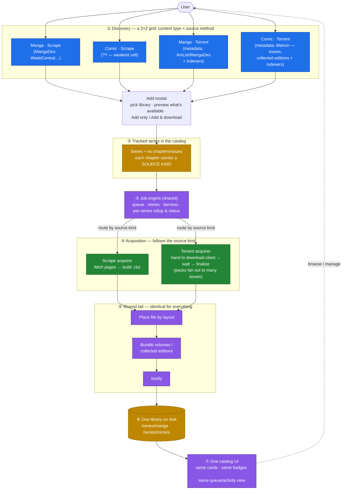
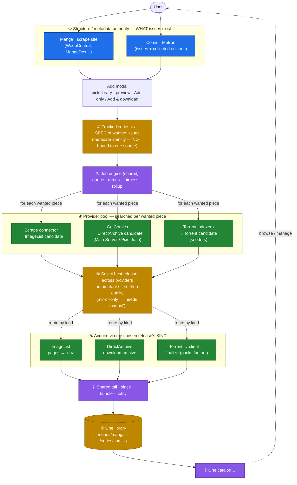

# Unified content design — manga & comics, one engine

> High-level intent, not a technical spec. The point: **content type and how you source it are
> independent.** Discovery is a 2×2 grid; everything after it is one shared spine — one engine, one
> library, one catalog.

## The key realization (your refinement)

Discovery isn't "manga search vs comic search." It's **two independent axes**:

- **Content type:** manga · comic
- **Source method:** scrape (a site provides metadata *and* pages) · torrent (a metadata authority
  provides structure, indexers provide releases, a download client fetches them)

That makes a **2×2 grid** — any content type can, in principle, be sourced either way. The acquisition
path then follows from the source method (scrape source → scrape acquirer; torrent source → torrent
acquirer). Content type does **not** pick the pipe — the *source* does.

| | **Scrape / direct-download** (site provides the files) | **Torrent** (metadata authority + indexers + client) |
|---|---|---|
| **Manga** | MangaDex, WeebCentral, Mangaworld (page readers → ImageList) — **built, works** | metadata via AniList/MangaDex (already integrated) + indexers; manga batches/volumes common on trackers — **plausible, not built** |
| **Comic** | **GetComics.org** — direct-download packs/runs (CBZ/CBR) → fits the existing **DirectArchive** acquirer. Metadata/structure from **Metron**. No quota, Cloudflare handled by FlareSolverr (already configured). — **VIABLE, likely the PRIMARY comic path** | metadata via Metron + indexers + client — **works in principle but fights the indexer quota; better as a FALLBACK** |

Finding (2026-06-10, researched): **comic scraping is viable and probably better than the torrent
path.** GetComics.org is the de-facto comic source — complete runs and collected editions as direct
CBZ/CBR downloads, scraped from HTML (the model Mylar3 uses; kenku already appears to Prowlarr as
Mylar). It sidesteps the indexer quota wall entirely and maps onto the **DirectArchive** acquirer kind
kenku already has. So the earlier "Comic·Scrape is the weakest cell" call is **reversed**:

- **Comic·Scrape (GetComics, DirectArchive):** likely the **primary** comic path. No 429s, no seeders,
  packs as single archives. Cloudflare cleared by the FlareSolverr the homelab already runs.
- **Comic·Torrent (Metron + indexers):** still valid, but the per-issue search × quota math makes it a
  **fallback**, not the default.
- **Manga·Torrent:** still an open follow-on (metadata via AniList/MangaDex + indexers; real demand for
  batch releases).

## Flow

## How to read it

- **① is a grid, not a fork.** Four discovery cells (content type × source method), each a distinct
  search experience, all funneling into one add modal. Some cells are rich, some sparse — that's fine,
  the grid just makes the choices explicit.
- **The source method chosen at ① determines the acquirer at ④** — scrape→scrape, torrent→torrent. The
  series row in ② just remembers each chapter's source kind so ③ can route it. Content type never
  routes anything; it only shapes *discovery* (which metadata authority, which search UI).
- **③ ⑤ ⑥ ⑦ are one shared spine.** Queue, place, bundle, notify, library, catalog — untouched by
  adding a new discovery cell. A comic issue from a torrent is just "a chapter with a torrent source";
  the queue can't tell it from a manga chapter scraped off WeebCentral.
- **Issues ≈ chapters; collected editions ≈ volumes** — the existing volume-bundle layout already
  models "many chapters → one bound file" (a TPB).

## What's built vs new

| Piece | State |
|---|---|
| Job engine, rollup, place, bundle, notify, catalog (③⑤⑥⑦) | **built** — shared today |
| Manga·Scrape cell + scrape acquirer | **built** — works in prod |
| Torrent acquirer → client → finalize (④ torrent) | **built**, proven in tests; the no-code gate proves it live |
| Comic·Torrent discovery (Metron metadata + issue lists) | **new** — the main slice |
| Pack fan-out in finalize (one torrent → many issues) | **new** — the one new download-side mechanic |
| Manga·Torrent cell | **open** — plausible, decide demand before building |
| Comic·Scrape cell | **open** — maybe deliberately empty |

## Refinement: multi-source release resolution (per-piece, best-available)

The grid above treats each cell as a separate *add path*. A stronger model (the real arr model):
**decouple "what you want" from "where each piece comes from."** A series' chapters/issues are a spec
defined by a **structure/metadata authority**; at download time each piece is resolved **independently**
across a **pool of release providers**, picking the best available — so different issues of one series
can come from different sources.

The structural signature of multi-source: the **fan-out at ④** (engine → every provider, per piece)
and the **converge at ⑤** (pick one). The old model had a single arrow "engine → acquirer by the
chapter's one bound kind"; this replaces it with search-pool → select → acquire.

Why this is the right shape:
- **"Different pieces from different sources" is automatic** — resolution is per-piece, so issue 1 can
  come from GetComics and issue 2 from a torrent.
- **Resilience by diversity** — torrents quota-throttled? GetComics still answers. GetComics
  mirror-only for an issue? A torrent may have it. (Both failure modes happened live on 2026-06-10.)
- **Generalises the existing `ReleaseSelector`** from "best torrent" to "best release across providers"
  (seeders for torrents; host-automatability for GetComics).
- **Acquirers are unchanged** — DirectArchive / Torrent / ImageList already exist and are routed by the
  chosen release's kind.

What it requires that doesn't exist yet:
- A **provider abstraction** (`search(wantedItem) → candidate releases tagged {kind, host, automatable,
  quality}`) that GetComics, the torrent indexers, and scrape connectors all implement.
- A **release-resolution step** in the download path (today `ChapterDownloadService` picks an acquirer
  by the chapter's single bound source; it would instead resolve a release across the pool first).
- The structure/source split: a chapter no longer *belongs to* one connector — it's a wanted item with
  a metadata identity, resolved at download time.

This is a larger arc than one connector. Manga can stay single-bound (scrape) for now; the multi-source
model is most valuable for comics, where no single source is complete.

## Risks / open problems (surface before building Stage B)

Ordered worst-first. Note which exist in Stage B (multi-source) but **not** Stage A (GetComics as a
single bound source) — that asymmetry is the argument for sequencing.

1. **Unbound-chapter model change — core rearchitecture (Stage B only).** Today a chapter *is* its
   `SourceId`. Unbinding it ripples through DownloadReconciler, dedup keys, cover, file-naming, rollup,
   plus a migration for existing series. Job-runtime-scale change; big-bang risk vs incremental delivery.
2. **Cross-source identity matching — the crux (Stage B only).** Matching heterogeneous release names
   (Metron "issue 106" vs GetComics "Invincible #106 (2014)" vs torrent "Invincible.106.…cbr") to a
   canonical issue is fuzzy and error-prone (harder than the existing MangaDex volume matching). Wrong
   match = silently wrong file. Without it the multi-source premise doesn't deliver.
3. **Packs break "one job = one issue" (mostly Stage B; partly Stage A).** Ownership (which job pulls a
   144-issue pack?), fan-out mechanics (zip-of-cbz = separable; one giant cbz = not), and partial
   fulfillment (don't re-grab a pack for the issues it already covered). Under-specified and messy.
4. **Search cost multiplies the quota wall (Stage B only).** Per-issue × per-provider = the 429 problem
   we hit, multiplied. Pack-first search mitigates but leans on unsolved #2/#3.
5. **"Best release" across heterogeneous sources has a degenerate case (Stage B only).** A scrape reader
   is always available + automatable → naive "automatable-first" means scrape always wins, torrents
   never used. Selection must weigh availability AND quality AND format AND completeness.
6. **Metron coverage gaps → permanent NeedsAttention.** 144 wanted but 90 exist anywhere → 54
   forever-failing jobs. Needs an explicit "unavailable, stop wanting" state.
7. **Mirror-only → "manual" implies a manual-import flow that doesn't exist.** Letting a user drop a
   hand-downloaded file in and have kenku adopt it is a whole new surface.
8. **Scrape-as-provider is a partial category mismatch.** A reader has exactly one way to get a chapter
   (no seeders/size/alternatives); the provider abstraction must accommodate both "one way" and "N
   candidate releases."
9. **Test-matrix growth + dual-use posture.** The resolution/selection/pack layer balloons the test
   surface (outside-in + mutation still required), and aggregating GetComics + mirror resolvers nudges
   kenku further toward "aggregates download sources" — still dual-use (Mylar does this), worth noting.

**Sequencing implication:** #2, #3, #4, #5 are all Stage-B-only. Stage A (single-bound GetComics) has
none of them, *and* it probes the two hardest unknowns cheaply — whether GetComics' naming is reliable
enough to match on (#2) and how packs actually present (#3) — before any `SourceId` rearchitecture.
Discover GetComics' messiness in a connector, not after rebuilding the core model.

## Build order

**Don't build a "comic pipeline."** Add GetComics as **one more source** plugged into the existing
spine (Stage A); only then design the multi-source resolution layer (Stage B — the ④⑤ band above).
The detailed Stage A brief follows; Stage B stays at the design level until Stage A's evidence is in.

---

# Stage A — implementation brief (self-contained, for a fresh agent)

**Goal:** add GetComics.org as a single comic source so a user can search it, add a comic, and have
its archives download — using only mechanisms that already exist. **No core-model change.** When done,
comics actually download (today: zero ever have), and you'll have learned how GetComics' naming and
packs really behave — the two unknowns Stage B hinges on.

## 0. Orient first (read these, in order)

### Development context — the rules to code by (non-negotiable)

These govern *how* you build, independent of GetComics. They are the project's standing engineering
contract (same rules used across the codebase; mirrored in `docs/job-runtime-rearch.md` §7).

- **Strict Red → Green → Refactor.** Every behavioural change starts with a **failing test**. Bug fixes
  begin with a test that reproduces the bug. No production change without a test that was red first.
- **Outside-in TDD.** Start with a failing **integration test** that defines the contract (inputs →
  observable outputs: DB rows, files on disk, job status, HTTP responses), then drive the internals with
  unit tests. When the units pass, the integration test must pass.
- **Mutation-verify every behavioural change.** After green, revert the production change and confirm the
  test goes **red** again, then restore. No hollow tests.
- **Circle architecture (seams & boundaries).** *Inner ring* = core logic you own → fully unit-tested.
  *Outer ring* = 3rd-party libs, the network, the filesystem → covered by integration/e2e tests.
  **Mocking rule: NEVER mock a 3rd-party or system dependency directly.** Encapsulate it behind an
  abstraction **you own** and mock that. (In this repo: HTTP is behind `IHttpRequester`; the download
  client behind `IDownloadClient`; the clock behind `IClock`. Use those, never a raw `HttpClient`/`Mock<HttpMessageHandler>`
  at the domain layer.) Assertions must be **strong** — assert structure, types, values, and boundary
  interactions, not just "not null".
- **YAGNI & simple design.** Build only what Stage A needs now; no speculative abstraction. (The Stage B
  provider/resolution layer is explicitly *not* yours to build — see §4.)
- **DI at every seam.** Inject dependencies so tests swap only the edge. Never hand-construct what the
  container should build.
- **C#/.NET structure conventions** (match the existing code): group by component type
  (`Connectors/`, `Acquirers/`, `Services/`, …); put interfaces in a sibling `Interfaces/` folder;
  register services via the **layer extension methods** in `api/API/Extensions/` (don't add registrations
  inline in `Program.cs`); pick lifetimes deliberately — `Transient` (stateless), `Scoped` (per-request /
  per-job, DbContexts), `Singleton` (shared state); avoid captive dependencies. Tests mirror source
  paths under `api/Tests/Unit/<area>` and `api/Tests/Integration`.
- **Code hygiene (no AI slop).** Write code that reads like the surrounding code — match its naming,
  structure, and **comment density**. Comments explain *why*, never restate the code; no banner/section
  comments, no narration, no commented-out blocks, no dead code or unused usings. **Delete what you
  replace** — each slice should leave net surface flat or smaller, not just add.

### Commits & delivery (exact format)

- **Single-line Conventional Commit: `type: short description`.** Examples of `type`: `feat`, `fix`,
  `refactor`, `chore`, `docs`, `test`. **No scope** (not `feat(comics):`). **No body.** **No
  self-promotion** — no `Co-Authored-By:` trailer, no "Generated with Claude Code" or similar. Same rule
  for PR titles/bodies. (`feat:` → minor release, `fix:` → patch, via semantic-release.)
- Commit on `main` (this repo is trunk-based — no feature branches), **one commit per verified slice**,
  push after each slice is green + mutation-verified.
- **The model to copy:** `api/API/Connectors/IndexerBackedSeriesSource.cs`. GetComics is its
  *direct-download sibling* — same "collapse search results into series" shape, but `Kind =
  DirectArchive` and sourced from scraped HTML instead of indexers.
- **The base class:** `api/API/Connectors/SeriesSource.cs` (abstract; what every connector implements).
- **A real scrape connector for the parsing pattern:** `api/API/Connectors/WeebCentral.cs` and its test
  `api/Tests/Unit/Connectors/WeebCentralTests.cs` (synthetic HTML + `Mock<IHttpRequester>` — copy this
  test shape).
- **The acquirer you'll use:** `api/API/Acquirers/DirectArchiveAcquirer.cs` (+ `Interfaces/IChapterAcquirer.cs`
  for the `AcquireResult` contract: `Acquired(path) | Deferred | Failed(reason)`).
- **The download wiring:** `api/API/Services/ChapterDownloadService.cs` (`DownloadAsync` picks the
  acquirer by `seriesSource.Kind`), driven by `JobRuntime/Reconcilers/DownloadReconciler.cs` →
  `JobRuntime/Handlers/DownloadChapterHandler.cs`.
- **GetComics' real HTML structure & the mirror-only limitation:** the "Spike findings" section of
  `docs/comic-getcomics-plan.md` — read it; the selectors below are summarised from it.

**Build/test gotchas (this repo):**
- Run backend tests via the **Tests** project: `dotnet test api/Tests/Tests.csproj` (building
  `API.csproj` directly triggers OpenAPI generation to a system path).
- Tests need **Postgres on `localhost:5433`** (`Host=localhost;Port=5433;Username=kenku;Password=kenku_test`).
  Normally `docker compose -f api/docker-compose.test.yml up -d`; this workspace can't run Docker, so a
  native Postgres mirrors it — `sudo service postgresql start` if connections fail.
- Skip OpenAPI gen during iteration with `-p:DisableOpenApiGeneration=true`; regenerate the committed
  spec with `APP_DATA=/tmp/kenku-ef dotnet build api/API/API.csproj` when a DTO/endpoint changes.
- Frontend: `cd web/website && npm run test:component && npm run typecheck`; full build `npx nuxi build`;
  e2e `npm run test:e2e` (Playwright; needs a prior build).
- GetComics is Cloudflare-protected. Connectors fetch via `IHttpRequester`, which routes through
  FlareSolverr when `FLARESOLVERR_URL` is set (it is, in prod) — so use `downloadClient`/`IHttpRequester`,
  never a raw `HttpClient`.

## 1. The model decision (settled)

A GetComics **post** is the unit. Search returns posts (an issue, a pack, or a compendium). The
connector **collapses posts into series by parsed title** (exactly like `IndexerBackedSeriesSource`
does with releases), and each post becomes a **chapter** whose download target is that post. So:
`SearchManga` → distinct series; `GetChapters` → the series' posts as chapters; `Kind = DirectArchive`;
`GetChapterImageUrls`/`DownloadImage` throw `NotSupportedException` (GetComics has no page images —
copy `IndexerBackedSeriesSource`).

A downloaded pack lands as **one `.cbz`** (not split into issues) — acceptable for v1, readers handle
big archives. Splitting packs into issues is Stage B.

## 2. GetComics structure (selectors, from the spike — verify against live HTML, they drift)

- **Search:** `https://getcomics.org/?s=<url-encoded query>` (paged: `/page/N/?s=`). WordPress.
- **Post links on a results page:** `h1.post-title a` (href = the post page). Each result also has a
  cover ``, `Year :`, `Size :`, a category link, and a description snippet.
- **Post page download links:** the GetComics-hosted "Main Server" link is `a[title="Download Now" i]`;
  mirror buttons live in `.aio-button-center` containers as `<a title="…">` naming the host (`Mirror
  Download`, `MEGA`, `Mediafire`, `Pixeldrain`, `Terabox`, `Zippyshare`, `Userscloud`, …). Three post
  shapes: **single** (one Download Now), **multi-single** (several Download Now, one per issue — title
  from the `strong` in the preceding `
`), **mirror-only** (no Download Now).
- **Automatable hosts:** Main Server ("Download Now", a redirect to the file — `DirectArchive` follows
  redirects), **Pixeldrain** and **Mediafire** (need a small per-host resolver to turn the page URL into
  a direct file URL). **Mega / Terabox / WeTransfer cannot be automated** — surface as "needs manual",
  never silent-fail. Many posts (e.g. the Invincible *Compendium*, checked live) are mirror-only.

## 3. The slices (each: failing test → minimal impl → mutation-verify → commit → push)

**A1 — GetComics connector (search + collapse + list).** New `api/API/Connectors/GetComics.cs`,
`Kind = DirectArchive`, modelled on `IndexerBackedSeriesSource`. Implement `SearchManga` (scrape
results → group posts into series by parsed title), `GetMangaFromUrl`/`GetMangaFromId` (post → series +
cover), `GetChapters` (series' posts → chapters; put the **post URL** in the chapter's `WebsiteUrl` for
now — resolution is A3). Unit-test like `WeebCentralTests`: feed synthetic HTML via `Mock<IHttpRequester>`,
assert parsed series/chapters against the selectors in §2 (cover the three post shapes). **Loud on
selector miss** — a parse failure must throw, never return an empty list silently (the bug that made
"I am a hero" invisible; see `SeriesChapterSyncService`/WeebCentral 404 handling). Register it: add to
`ApplicationServiceCollectionExtensions.AddKenkuConnectors` as a `SeriesSource` singleton (it needs only
`IHttpRequester` + settings — **not** gated on a download client, unlike the torrent path).

**A2 — DirectArchive download through the runtime, live-proven (the comic gate).** Prove a GetComics
chapter downloads end-to-end via the existing `DownloadChapter` job → `ChapterDownloadService` →
`DirectArchiveAcquirer` → `.cbz` on disk → `Downloaded`. Integration test on the booted app using
`KenkuApplicationFactory` with `ExtraConnectors = [stubGetComics]` and a `PostgresConnectionString`;
model it on `api/Tests/Integration/TorrentDownloadEndToEndTests.cs` and `ConnectorFlowEndToEndTests.cs`.
This is *easier* than the torrent gate — synchronous download, no client/poll. Then verify live in prod.

**A3 — download-link resolution + mirror handling.** Resolve a GetComics **post URL → a fetchable
archive URL**: prefer Main Server (`a[title="Download Now"]`, a redirect `DirectArchive` already
follows); else Pixeldrain/Mediafire via a small resolver; else (Mega/Terabox/WeTransfer only) return
`AcquireResult.Failed("only available via <host> — download manually")` so it lands in NeedsAttention
with a clear reason. **Open decision for the implementer:** resolve eagerly in `GetChapters` (simpler;
but re-fetches every post each sync) *or* lazily at download time (cheaper; needs a resolution seam
before `DirectArchive`, since `DirectArchive` is generic and would otherwise download the post's HTML).
Recommend lazy — add the resolution as a step the GetComics path owns, keep `DirectArchive` dumb.

**A4 — comic-kind in the UI.** Today `web/website/app/composables/useSeriesKind.ts` flags a series as
`comic` only when every source's connector `kind === 'Torrent'`; GetComics is `DirectArchive`, so it'd
show as manga. Extend the rule to treat `DirectArchive` as comic too (`kind === 'Torrent' ||
kind === 'DirectArchive'`). Add/extend the component test (`test/component/seriesKind.test.ts`). This
makes the detail page hide MangaDex volume-mapping and offer Metron, per the S5 comic divergence.

## 4. Explicitly OUT of scope for Stage A (do NOT build — these are Stage B)

Cross-source matching; per-issue multi-source resolution; the provider abstraction and the ④⑤ band;
unbinding chapters from `SourceId`; Metron as a structure authority; splitting packs into issues
(pack = one `.cbz`); the manual-import flow for mirror-only posts. Keep the torrent path exactly as-is —
GetComics is added *beside* it, not merged with it. If a slice tempts you toward any of these, stop:
it means you've crossed into Stage B, which is a separate designed arc.

## 5. Definition of done (Stage A)

A comic searched on GetComics can be added and its automatable posts download to `/series/comics/…` as
`.cbz`, visible in the catalog as a comic, with mirror-only posts parked in NeedsAttention with a clear
reason — all green (backend Tests project + frontend component/e2e), each behavioural change
mutation-verified, the torrent path untouched, and A2 confirmed live in prod.

## 6. Things that will bite you (pre-flight + traps)

- **Establish the baseline first.** Before touching anything, run `dotnet test api/Tests/Tests.csproj`
  and `cd web/website && npm run test:component && npm run typecheck` and confirm they're **green**
  (~618 backend tests at time of writing). That green suite is your safety net — keep it green after
  every slice. If Postgres won't connect, `sudo service postgresql start`.
- **Ground the selectors against REAL HTML — do not code against the summarised selectors blindly.**
  They drift (we hit exactly this with WeebCentral's chapter-list URL this month). Before A1, obtain a
  real GetComics search-results page and 2–3 real post pages (one single, one multi-single, one
  mirror-only). GetComics is Cloudflare-protected, so a plain fetch may fail — fetch through the
  homelab FlareSolverr, or **if you can't reach the site, ask the user to paste the raw HTML** rather
  than guessing. Turn the relevant slices of that real HTML into small synthetic fixtures for the unit
  tests (the WeebCentral test pattern). The cross-reference scraper for selector confirmation is
  `csandman/get-comics` (`src/parse-links.ts`, `parseIndexPage`/`parseDownloadLinks`).
- **Empty search ≠ parse failure.** A search that legitimately returns no posts must return an **empty
  list**; a parse that *expected* posts and found none (selector miss, redirect to an error page) must
  **throw** so the job surfaces it. Don't conflate them — that conflation is the "I am a hero" bug.
- **Populate `CoverUrl`.** Parse each post's cover `` into the series' `CoverUrl`, or comics show
  the default logo (the exact bug the indexer-backed source has — it leaves `CoverUrl` empty). The
  cover then flows through the existing cover-download path automatically.
- **`IHttpRequester` is the HTTP seam.** Fetch via the connector's `downloadClient`
  (`IHttpRequester.MakeRequest(url, RequestType, …)`), which rate-limits per host and routes through
  FlareSolverr — never a raw `HttpClient` (Circle-architecture mocking rule + Cloudflare). For the
  title-collapse parser, reuse/model `api/API/Indexers/ReleaseTitleParser.cs`.
- **A2's "verify live in prod" is the USER's gate, not yours.** You cannot deploy or read the prod
  cluster. Get A2 green in the booted-app integration test, then **hand the live-verification step to
  the user** (cut a release, deploy, watch a real GetComics download land a `.cbz`). Don't claim the
  live gate passed — only that the test proves the wiring.
- **A new `SeriesSource` auto-appears in search.** The frontend search page lists connectors from
  `/v2/SeriesSource` and the add-modal calls `GetChapters` for the preview — so once registered,
  GetComics shows up with no extra frontend wiring beyond A4's kind detection. Verify the add-modal
  chapter preview renders GetComics posts.
- **Politeness/quota.** Scraping per-post in A3 can hit GetComics a lot; the per-host `RateLimitHandler`
  already throttles, but prefer lazy resolution (resolve only the post you're downloading) over eager
  (resolving every post on every sync).

## 7. Report back — Stage A is also a probe

Stage A exists partly to de-risk Stage B (see Risks #2, #3). When done, append a short findings note to
`docs/comic-getcomics-plan.md`:
- **Naming reliability (#2):** how cleanly do GetComics post titles collapse into series / map to issue
  numbers? Examples of messy cases. Would cross-source matching against these be feasible?
- **Pack presentation (#3):** what do real packs look like on disk after download — a zip of per-issue
  `.cbz`, or one monolithic `.cbz`? Are they separable into issues?
- **Automatable coverage:** rough fraction of posts that had an automatable host (Main Server /
  Pixeldrain / Mediafire) vs mirror-only. This decides whether GetComics-alone is worth it or Metron +
  multi-source (Stage B) is required.
