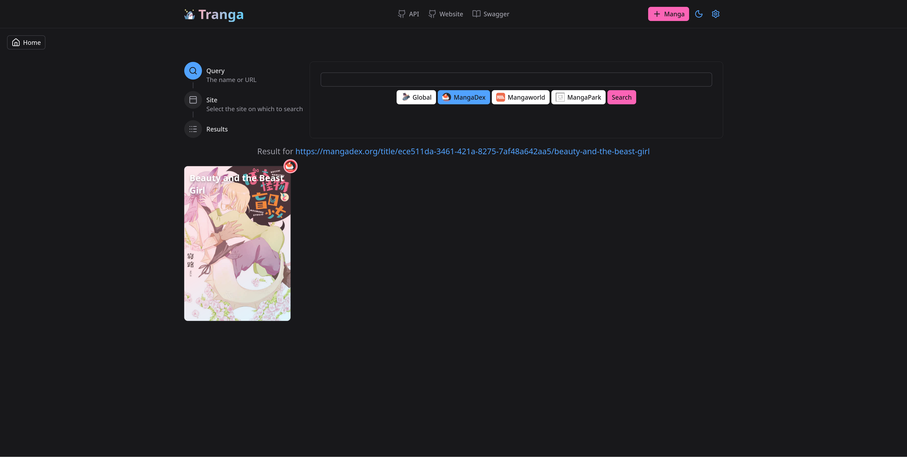
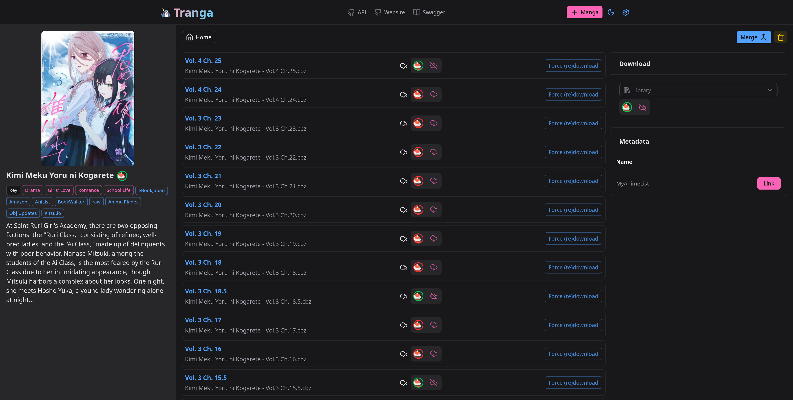

<div align="center">
  <h1>Kenku — Frontend (Web UI)</h1>
  <p><em>Nuxt 4 / Vue 3 web interface for the Kenku API.</em></p>

  
</div>

This is the frontend half of the [Kenku](../README.md) monorepo: a Nuxt single-page
app that is **prerendered to static assets** and bundled into the Kenku image, where
the .NET backend serves it from `wwwroot` on the same origin as the API. There is no
separate web server.

The UI is a thin, fully-typed client over the backend's REST API. Its API client and
types are generated at build time from the backend's OpenAPI spec
([`../api/API/openapi/API_v2.json`](../api/API/openapi/API_v2.json)) via
`nuxt-open-fetch`. Because the UI and API share an origin, requests go straight to
`/v2/...` with no proxy or CORS hop.

## Screenshots

|  |  |  |
|--------------------------------------|-----------------------------------|-----------------------------------------------|
| Library                              | Search                            | Series detail                                 |

## Screens

- **Library** — grid of tracked series; comic series are badged and get a comic-
  specific experience (no manga volume mapping).
- **Search** — find new series across the configured sources, per source or all at
  once, with a chapter preview before adding.
- **Series detail** — chapters, metadata linking & volume mapping (manga) or Metron
  enrichment (comics), per-source download toggles, merge, and delete; the page
  refreshes itself while jobs for the series are running.
- **Activity** — the live job queue (stable order, rows expand to the full error,
  retry/dismiss/cancel) and the backend's action/audit log.
- **Settings** — file libraries and library servers (Komga/Kavita), sources
  (enable/disable, download language), Prowlarr setup (Kenku's base URL + API key to
  paste into Prowlarr as a Mylar application) with the synced-indexer list and its
  rate-limit state, download-client management, torrent release selection, Metron
  credentials, notifications (Gotify/Ntfy/Pushover/webhooks), and maintenance
  (cleanup triggers, completed-job retention). The deployed version shows in the
  header.

## Built with

- [Nuxt](https://nuxt.com/) 4 · [Vue](https://vuejs.org/) 3 · [Vite](https://vitejs.dev/)
- [Nuxt UI](https://ui.nuxt.com/) + [Tailwind CSS](https://tailwindcss.com/)
- [nuxt-open-fetch](https://nuxt-open-fetch.vercel.app/) (typed client from OpenAPI)

## Local development

The app lives in [`website/`](website/). It needs the OpenAPI spec at
`../../api/API/openapi/API_v2.json` (present in this monorepo) to generate its client.

```bash
cd web/website
npm install
npm run dev        # dev server; point it at a running Kenku API (same-origin)
npm run generate   # prerender to static assets in .output/public
```

## License

GNU GPL v3 — see [`LICENSE`](../LICENSE). Credits in [`NOTICE`](../NOTICE).
